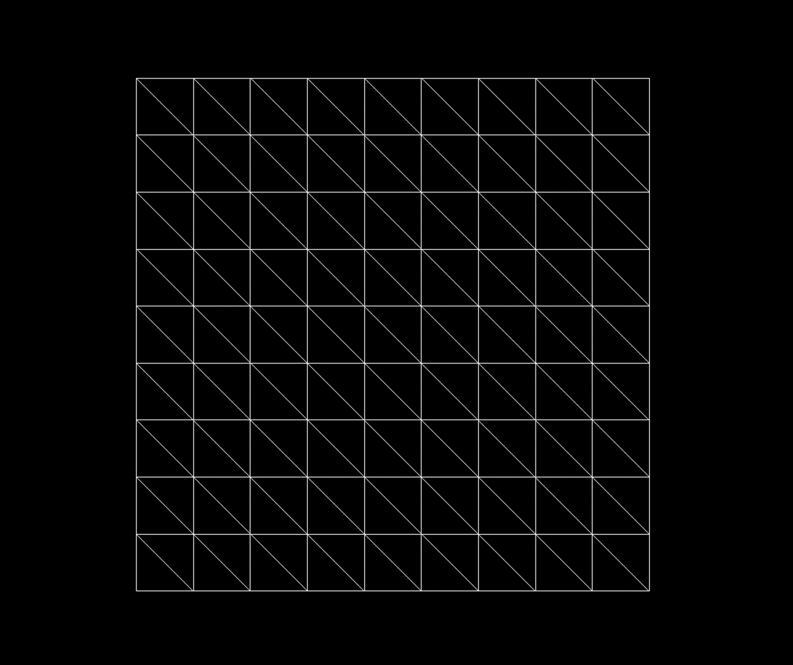
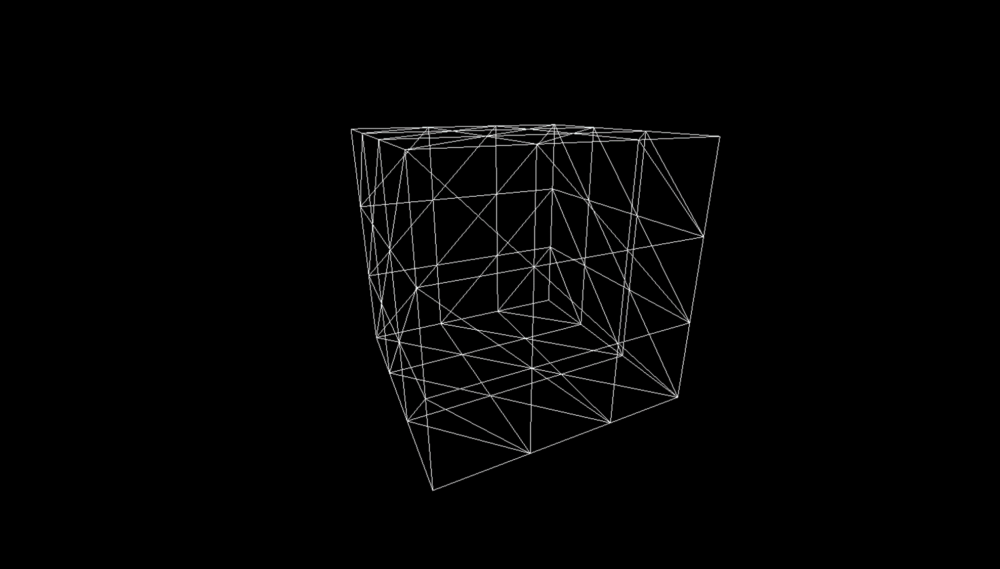
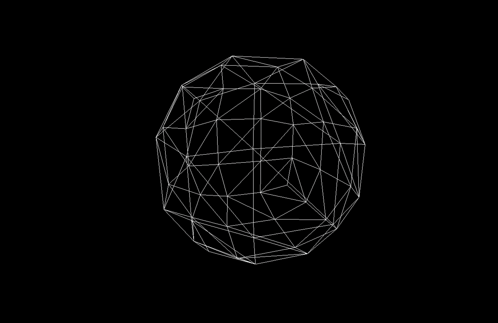
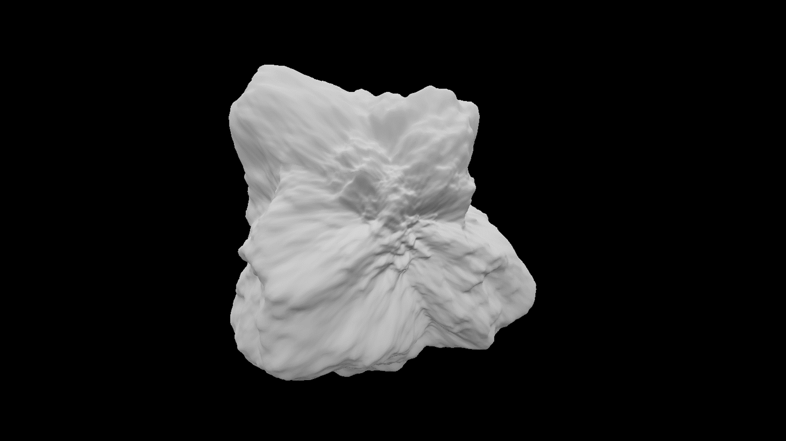
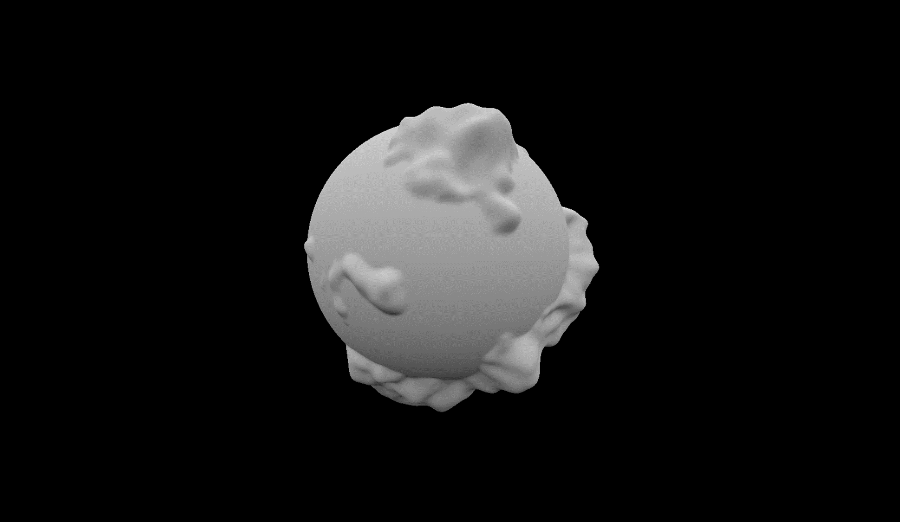
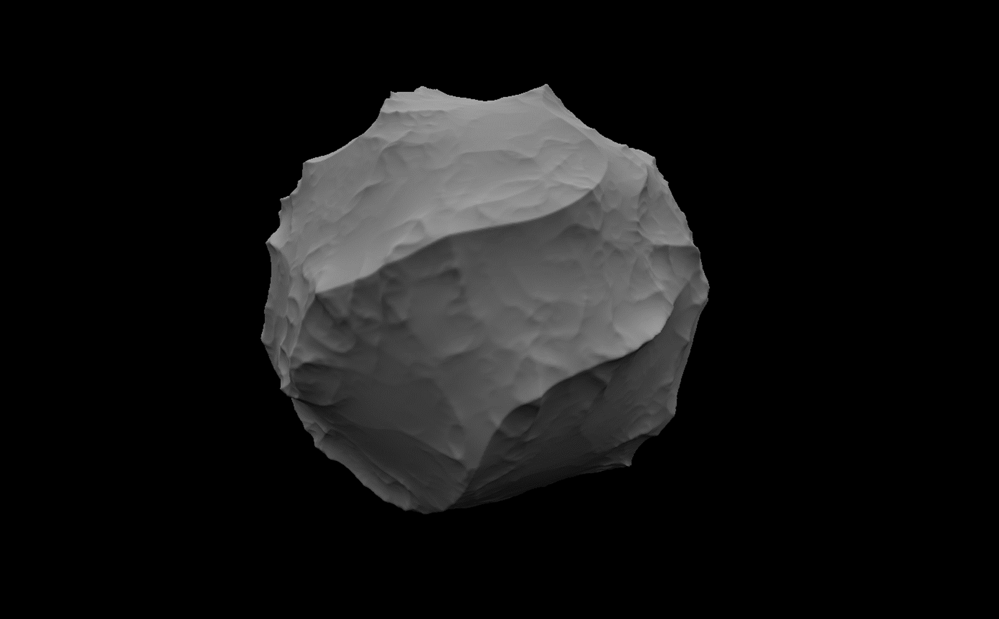
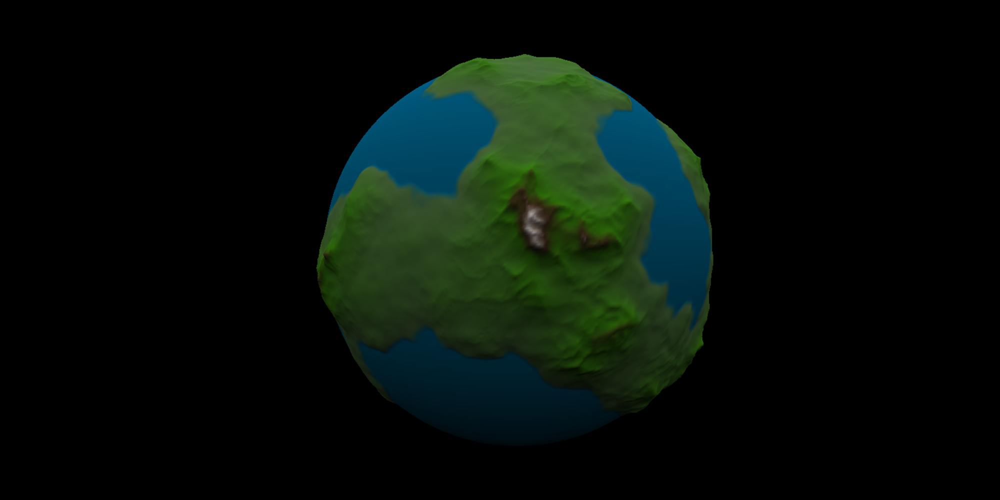

## Technologies
This portfolio site is built using Nuxt.js and three.js. Nuxt.js is a static site generator for Vue.js, a JS framework. Three.js is used to render 3D elements in real-time on the page, like the planet and laptops on this site.

## Planet
The planet is procedurally generated every time the page is reloaded. It's made by placing vertices and then connecting them all together into tris and faces and eventually the whole mesh. Noise is then used to deform the sphere to create terrain. Finally colour is added and the planet is rendered onto the page. But while I can summarize the process in a couple of sentences the actual process went through many more challenges and obstacles like any good programming project.

## Creating the Sphere
Creating the sphere was the first challenge to overcome. A default option is an UV sphere, which is evenly divided into rows and columns.   This creates the problem of having a higher density of faces and vertices near the poles of the sphere. This would not work well for my purposes because I don't want the planet to have higher levels of details near the poles.

A second option would be to use an ico sphere, which has equally sized triangles. This gives me an even distribution of detail across the sphere however due to the nature of triangles I can only increase the number of faces by a factor of four. This gives me very little granularity and control of how detailed the sphere is.

The third option is to start with a cube, and then normalize ever vertices position from the center. This sphere has a very even distribution of detail, with only slightly more detail near the seams where the sides of the cube have come together. It also gives me a high granularity of detail as I can divide the sides of the cube into as many faces as I'd like.

To construct the sphere I went on side of the cube at a time, creating a grid of vertices then connecting them together into tris that then make faces. Create six of these sides and then I have a cube. Normalize each vertices position to the center and then I have a sphere.

## Noise
The next step is to deform the sphere using noise. I can layer more noise with smaller scales on top to create detail. This gives me large deformations in the terrain like mountains and valleys as well as small deformations that make up the detail.

To create an ocean I simply set a minimum elevation that every vertex has to be at.

To add more detail and interest to the planet I can use multiple different noise generators with different settings. I have the default noise generator that creates general waviness in the terrain. And then I have a ridge noise generator which is very similar to the default noise generator, except all the noise values are fed through the formula $$(1 - |sin(x)|)^2$$. This creates sharp ridges lines which form into mountain ranges.

## Colour
Adding colour is a fairly simple endeavour. I assign colour to each vertex based off of it elevation. A gradient is built of colours at different elevations; starting from the ocean colour, then going to the general ground colour, then the mountain colour and then the peak colour.

The most challenging part of adding colour is creating the gradient. How do I smoothly get from one colour to another? The solution to this problem is so elegant. I treat colour as a 3D space where each axis is a different colour: red, green and blue. 

I then insert my two colours as points in this 3D space. All that's left to do is to draw a line and move along that line to fill in my gradient. Stringing multiple of these gradients together gives me the full gradient of different elevations.

__
## Performance
I wanted the site to load quickly. I understood that it wouldn't be as good as some other sites since it generate and load multiple 3D elements which take a lot of compute, but I wanted it to be close. Initially, the planet took 2-3 seconds to generate on my desktop computer, which is fairly powerful. This meant that it would take 6-8 seconds for the page to load on mobile devices, which just wasn't going to work. So I used Firefox's profiler to profile the page load and noticed a few interesting things.

The first was that around 700ms was being taken up by calls to `_toConsumableArray`. I found that this was the internal function that was called when you unpack an array or object with the spread operator (`...`). I'd been using this operator to unpack objects all over my codebase. I removed all uses of that operator and just manually unpacked objects saving me almost of second of load time.

The second thing I found was a lot of time was being consumed checking if private variables could be accessed. Since I'm used to Java, I'm used to controlling the access that each variable has. What I didn't know is that in JavaScript this adds a lot of overhead because the interpreter now has to check if a variable is allowed to be accessed every time it's accessed. Changing all my variables to public variables saved another ~500ms. I've since moved to TypeScript and I'm now using it's access modifiers which don't have any overhead.

This brings the planets generation time down to around 600-800ms which is a huge improvement from 2-3 seconds. There were a few more minor things like reusing objects in a loop instead of creating and destroying them over and over again that saved an additional 150ms. The final change I made was moving from Vue.js to Nuxt.js which brought the generation time to under 200ms. This means that on all mobile devices older than five years the page loads in under a second. 
